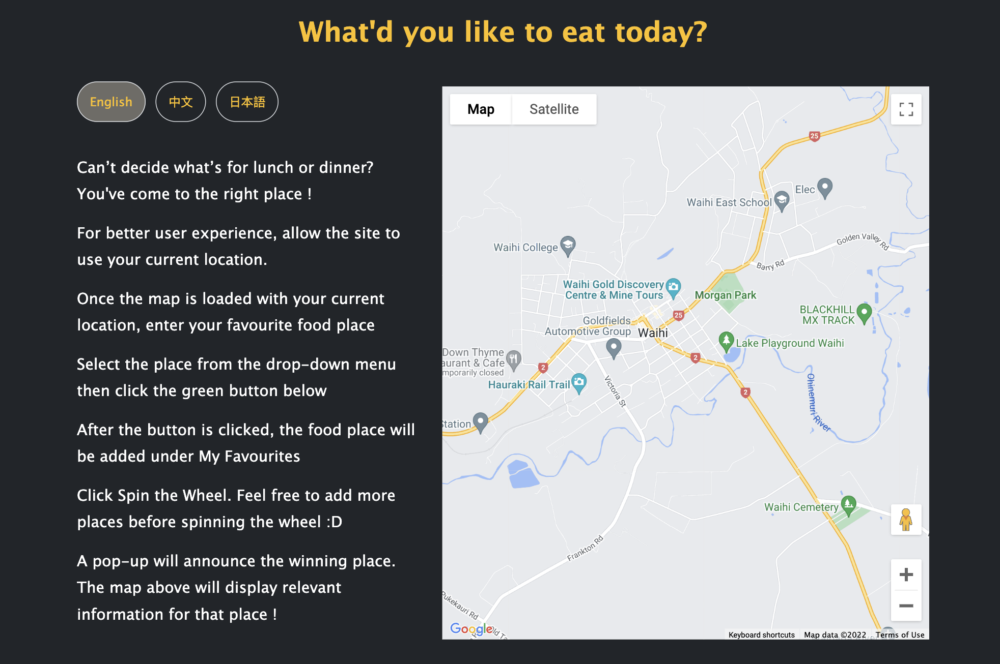
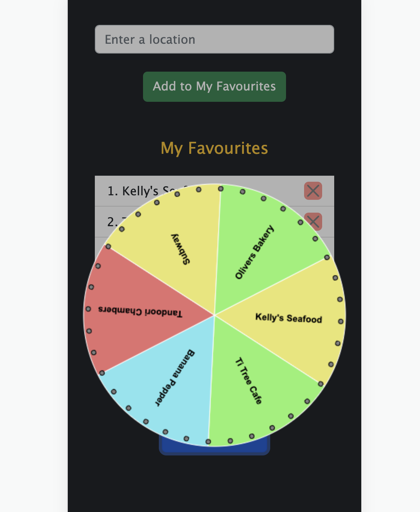

# What'd you like to eat today?

 
A responsive website that helps users to decide what to have for lunch or dinner.

Users can add or delete their selected food places then spin the wheel which will then announce the winning food place !

There is a Google map that will display relevant information for the winning food place. 

## Built With
- Bootstrap
- Javascript
- Google Maps Platform APIs 
- Winwheel.js

<!-- CONTRIBUTING -->
## Contributing
If you have a suggestion that would make this better, please fork the repo and create a pull request. You can also simply open an issue with the tag "improvement". Any contributions you make are **greatly appreciated**.

1. Fork the Project
2. Create your Feature Branch (`git checkout -b feature/AwesomeFeature`)
3. Commit your Changes (`git commit -m 'Add some AwesomeFeature'`)
4. Push to the Branch (`git push origin feature/AwesomeFeature`)
5. Open a Pull Request

(<a href="#top">back to top</a>)

<!-- LICENSE -->
## License

Distributed under the MIT License. See `LICENSE.txt` for more information.

(<a href="#top">back to top</a>)

<!-- CONTACT -->
## Contact

Chingwen Hu - cwhu823@icloud.com

Project Link: [https://github.com/subarashii-huch09/What-would-you-like-to-eat-today](https://github.com/subarashii-huch09/What-would-you-like-to-eat-today)

(<a href="#top">back to top</a>)

<!-- ACKNOWLEDGMENTS -->
## Acknowledgments

* [Choose an Open Source License](https://choosealicense.com)
* [Bootstrap](https://getbootstrap.com/docs/5.2/getting-started/introduction/)
* [Winwheel.js](http://dougtesting.net/winwheel/examples)
* [Google Maps Platform APIs Documentation](https://developers.google.com/maps/documentation/javascript)
* Novia YY Chen - Translation (Mandarin & Japanese)

(<a href="#top">back to top</a>)
